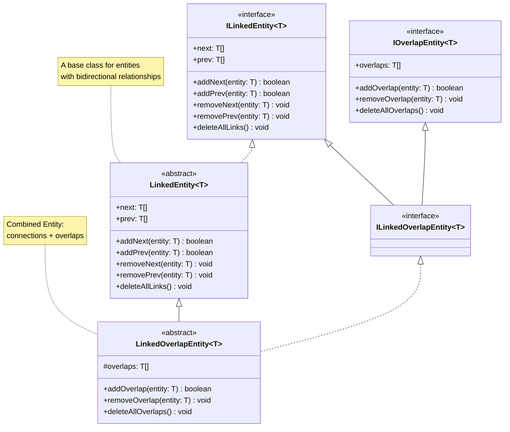
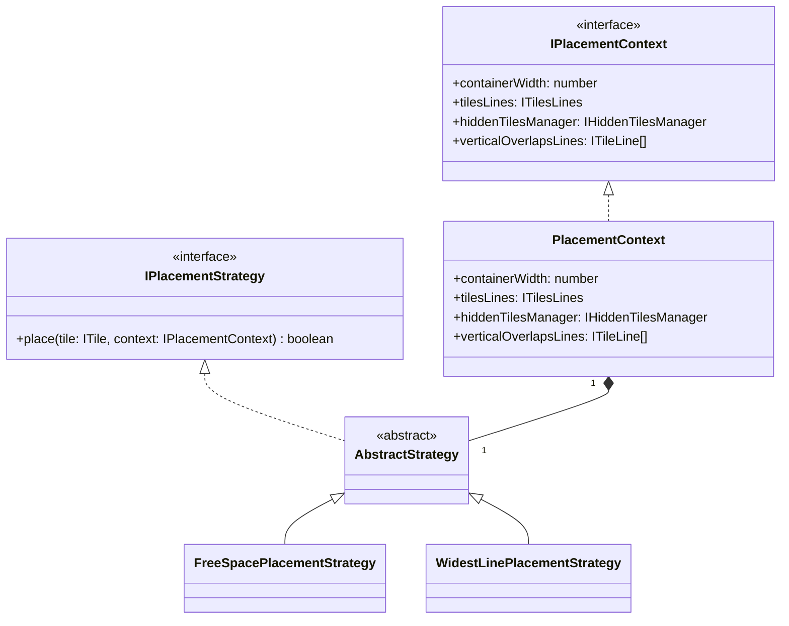
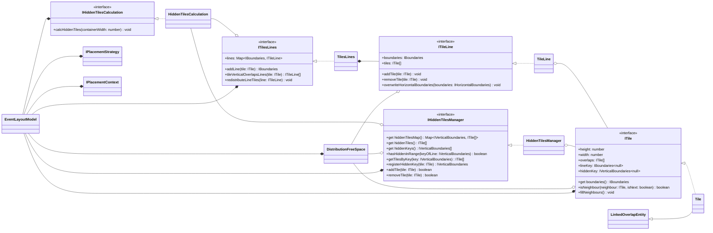
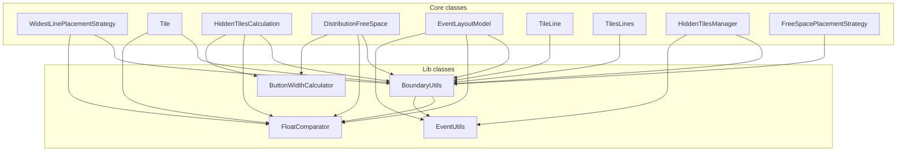

# EventLayout

This component contains the **core layout engine** responsible for positioning event tiles on the timeline canvas.

### Purpose

It is utilized by two primary view templates: `ScheduleDayTemplate` and `ScheduleWeekTemplate`.

### Layout Algorithm

- Tiles are algorithmically arranged to occupy the **maximum available space** within their designated time slots.
- The engine prioritizes visual clarity and efficient use of the canvas.

### Overflow Handling

- When the available horizontal/vertical space is insufficient to display a tile without overlap, the event is **hidden from the main canvas**.
- A specialized **overflow indicator button** is rendered on the timeline at the corresponding time slot.
- This button displays a count of hidden events (e.g., "+3").
- **Clicking the button** reveals a detailed popover list of all events collapsed at that moment.

### Key Responsibility

This component decouples the complex layout logic from the visual presentation, ensuring consistent behavior across different time-scale views.

## Class diagrams

### Linked list class diagram

### Diagram of placement strategy classes

### Core Model diagram

### Lib Dependencies diagram

